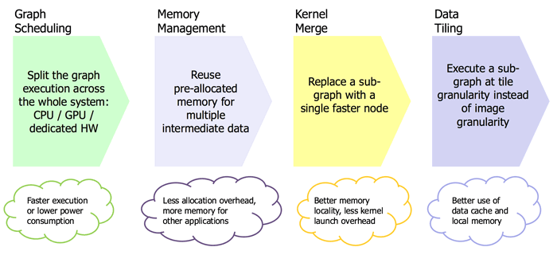

## LLM 推理加速   

   

* cnn-based(backbone) + cnn(head) [tensorrt](https://github.com/lix19937/trt-samples-for-hackathon-cn/blob/master/cookbook/readme_cn.md)     
基于TRT，自定义插件完成低效模块的计算，最终仍back到TRT中   

* transformer-based(decoder)  [tensorrt-llm](tensorrt-llm/readme.md)  https://github.com/NVIDIA/TensorRT-LLM           
对于无cnn的，如GPT2，不借助onnx解析器，自己搭建网络推理，典型的llama.cpp   llama2.c 这类针对特定结构开发的推理项目，以及 [vllm](./vllm/readme.md)          
https://lilianweng.github.io/posts/2023-01-10-inference-optimization/#distillation     

* cnn + transformer  tensorrt[plugin] + tensorrt-llm         
例如detr3d, vit 需要tensorrt[plugin] 与 tensorrt-llm 一起使用，实现最优效果

-------------------------------   
https://developer.nvidia.com/blog/mastering-llm-techniques-inference-optimization/

LLM Inference要做好需要算法以及工程系统性合作，会涉及到以下一些技术方向：    

|方向/技术点|说明 |   
|----------|----|   
|Inference算法部分| Transformer inference过程及加速原理|  
|解码策略及调参| GreedySearch、BeamSearch、Sampling、top_k、top_p、temperature、no_repeated_ngram_size等优化|   
|多机多卡的GPU集群分布式解码，并行（Tensor/Pipeline/MoE Expert parallelism）| 集群的搭建、不同机器以及卡的高效通信等|   
|高并发处理和优化|负载均衡，batch_size调优等|   
|系统底层相关|不同显卡型号、底层GPU驱动、内存管理、算子等|   
|其他工程相关|GPU集群管理，稳定性，日常维护等|   

下面先主要看下Inference核心部分          
### Inference优化目标    
Inference服务关注两个指标：**Latency** 和 **Throughput**。  这两个指标一般情况下需要**trade-off**。    
  
|指标 | 说明 |   
|---- | ----|   
| Latency | 关注服务体验，也就是返回结果要快，用户体验好。 <br><br> 延时，主要从用户的视角来看，也就是用户提交一个prompt，然后得到response的时间。特殊情况batch_size=1只给一个用户进行服务，Latency是最低的。计算方法为生成一个token所需要的单位时间数，如16 ms/token。 |   
| Throughput |关注系统成本，高Throughput则系统单位时间处理的量就大，系统利用率高，但是会影响latency。<br><br> 吞吐率，主要是从系统的角度来看，单位时间内能处理的tokens数，如16 tokens/sec。扩大Throughput的方法一般就是提升Batch_size，也就是将一个一个用户的请求由之前的串行改为并行。    |   

高并发时，把用户的prompt合在扩大batch_size能提升Throughput，但会一定程度上损害每个用户的latency，因为以前只计算一个请求，现在合并计算多个请求，每个用户等待的时间就长了。从我们实际的测试结果可以看到，Throuput随着batch_size的增大而增大，但是latency是随着减小的，当然Latency在可接受范围内就是ok的。因此指标需要trade-off。     
简单计算，对于一次请求来说：latency=batch_size * output sequence length / Throughput. 提升batch_size会提升Throughput，但Throughput与batch_size并不是同比例增大的，因此导致Latency随着batch_size增大而增大。

### Inference过程   
2个阶段 Prefill Phase和 Decoding Phase（见FlexGen）       

|阶段 | 说明|  
|----| ----|   
|Prefill Phase|预处理/Encoding。计算并缓存每一层的key和value，其他的不需要缓存。每一个请求的prompt需要经过这个阶段，它只计算一次，是并行计算的。这个缓存称为KV Cache，KV Cache是整个解码过程中最为核心关键的一块。|     
|Decoding Phase|生成新token阶段，它是串行的，也就是decode one by one。它用上一步生成的token，称为当前token放到input中，然后生成下一个token。具体包括两步，一是Lookup KV Cache计算并输出当前token最终embedding用来预测下一个token，二是缓存计算过程中得到的当前token在每一层的key和value，update到第一阶段Prefill Phase中的KV Cache中。|    

这样划分的好处是，每次解码，不需要对整个网络全部进行计算，相当于计算复杂度从O(n^3)变为O(n)了。Prefill Phase只需要计算一次，核心就是GPT-style的transformer是单向的，而不是双向的。每一个token只与它前面的tokens有关系，其key，value也只与它前面的tokens有关系，因此可以只计算一次且可以并行。后面decoding phase就很快了，避免了重复计算。整个的开销就只有key-value cache的update以及look-up的时间。   
有文章里面提出LLM inference is memory-IO bound, not compute bound。从下面的量化分析来看确实如此。

### Inference量化分析      
Inference的核心是KV Cache，以FP16为例，其对显存的占用量化分析如下。

其对显存占用分为两块，一是Weights、二是KV Cache。
```
Weights占用大约为layer_num * ( 8 * hidden_size * hidden_size + 4 * hidden_size * MLP_hidden_size )。  
KV Cache的占用为4 * batch_size * layer_num * hidden_size * ( input_length + output_length )。  
以OPT-175B 为例（layer_num = 96, hidden_size = 12288, MLP_hidden_size = 49152，batch_size=512，input_length=512, output length=32)。   
```   
Weights差不多占用 325G, KV cache 差不多占用 1.2T。对内存消耗是非常惊人。里面唯一可以调节的参数是batch_size，显存占用基本与batch_size呈正比关系。显存的大小限制了batch_size，而batch_size的大小就限制了Throughput。因此就有很多加速工作就是想办法节省显存，进而扩大batch_size。

### 加速优化方法   

|优化方向| 方法|     
|---    |---  |     
|Latency|优化底层的OP算子（高效kernel，如FMHA）、矩阵优化、并行、更高效的C++解码等，如FasterTrnasformer以及DeepSpeed。针对Latency的优化可以提升Throughput，但没有直接用batch_size提升的更显著。<br><br> **量化技术**，如gptq |     
|Throughput|主要是**KV Cache存取优化**，将transformer attention计算中的Key和Value张量集合缓存下来，避免每输出一个token都重复计算。本质是降低显存开销，从而可以提升batch size。这方面工作相对多一些，如**offloading技术**，就是如何高效利用第三方存储CPU/DRAM/Disk，使得GPU显存能空出来进而增大batch_size。<br><br> 如vLLM中的 **PagedAttention** 技术就是借鉴OS中的分页以及虚拟存储思想实现显存动态分配，也能节省很多显存空间。<br>如**continuous batching**，变传统的static batch为动态可复用的batch分配，同样也能尽可能扩大batch_size，进而提升Throughput。|    

### 一些主流加速框架   

| 名称| 出品方| 主打| 方法  |  备注  |     
| ----|------| ----| ---- | -------|    
| FasterTransformer| Nvidia | Latency| 90%的时间消耗在12层Transformer的前向计算上，总结优化点如下：https://zhuanlan.zhihu.com/p/79528308<br>为了减少kernel调用次数，将除了矩阵乘法的kernel都尽可能合并（这个可能是主要的）<br>针对大batch单独进行了kernel优化<br>支持选择最优的矩阵乘法<br>在使用FP16时使用half2类型，达到half两倍的访存带宽和计算吞吐<br>优化gelu、softmax、layernorm的实现以及选用rsqrt等   | - |       
|DeepSpeed|微软|Latency和 Throughput| 优化Latency：a multi-GPU inference solution.<br>parallelism：Tensor parallelism、Pipeline parallelism、Expert Parallelism（MoE）。对多机多卡之间的通信带宽要求较高 <br>communication optimization<br>optimized sparse kernels<br><br>优化Throughput：Zero-Inference也用到了offloading技术<br> 如何结合GPU显存以及其他外部存储设备如DRAM、NVMe等加载大模型，问题变为How to apportion GPU memory among model weights, inference inputs and intermediate results <br> 然后可以接受大的batch size，进而提升Throughput。| - |    
|llama.cpp|gg| Latency| offloading、高效C++解码   | 面向消费级CPU/GPU的Inference框架，主打易用性，CPU支持  |  
|vLLM     |UC Berkeley| Throughput| paged attention，动态分配K-V Cache，提升Batch_size <br><br>KV cache占用大量GPU内存，一个13B模型每个输出token对应的KV张量，需要800KB，而最长输出长度2048个token的话，一个请求就需要1.6GB显存。因此vLLM引入类似操作系统中的分页机制，大幅减少了KV cache的碎片化，提高性能。 | -  |  
|FlexGen  |Stanford/UC Berkeley/CMU/META  | Throughput| 在有限资源情况下如何高效利用CPU/Disk以提升Throughput  | -  |  
|Hugging Face pipeline Accelerate  |HuggingFace | Latency| distributed Inference （https://huggingface.co/docs/accelerate/usage_guides/distributed_inference）| -  |  
       
## gpu角度下dnn性能     
[understand-perf ](https://docs.nvidia.com/deeplearning/performance/dl-performance-gpu-background/index.html#understand-perf)   
解读     


https://zhuanlan.zhihu.com/p/649640010
