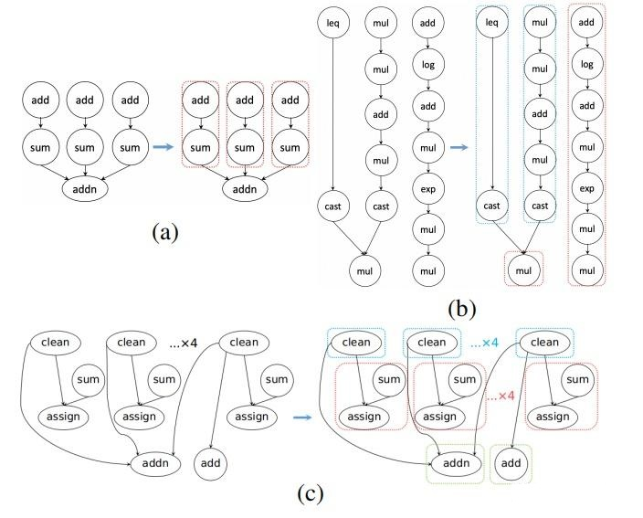

# 算子融合     

## 有依赖的融合  
减少了访存-内存墙   

从合并难度的角度，算子又被分为    
+ pointwise（elementwise）    
+ reduction  
+ 计算密集型Compute-bound，以下称CB，如matmul和convolution     
+ 访存密集型Memory-bound，以下称MB      
elementwise + elementwise, elementwise + reduction, reduction + elementwise, reduction + reduction

A = relu(B + C)

算子融合技术路线：    
+ 遍历路线：针对特定设备，枚举实现典型的CB+MB形式的融合算子，如Conv+ReLU/Conv+BN+ReLU/Dense+ReLU/Conv+Sum等等，Intel的oneDNN以及国内很多大厂的推理框架走的都是这个路线。  
+ 规则路线：基于规则实现算子融合，以TVM为例，其将所有算子分为Opaque/Injective/Reduction/Complex-out四类，并设定融合规则形如Complex-out+Injective/Injective+Injective/Injective+Reduction等，以此实现所有符合规则的子图融合。

## 无依赖的融合
可能会减少launch kernel时间和重复访存 - 并行墙      
保证计算图执行非CB部分的子图时也能充分利用设备的计算资源，这方面典型的工作是 TASO 和 RAMMER       
将计算过程中互不依赖的低计算量子图打包为一个kernel并行计算以提升资源利用率即识别无计算依赖的算子做并行计算。这里的关键在于如何在避免组合爆炸的前提下对可以并行的子图分组。   
  

--------------------------------------------   

## 特殊的layer   

## sigmoid  
是 elementwise op   
单调函数   多标签分类  

## softmax   
是 reduction op     多类别分类    

一般方法是 3次kernel  `获得全局最大值 M= max(x_i)， S=sum_i(exp(x_i - M))， y_i = x_i /S`        
online方法 或 1-pass方法  

先把全部数据集中到一个线程块，然后在一个线程块内做规约，由此得到全局最大值呢？  
如果这种方法行得通，我们就可以马上利用相同的方法把数据全部集中到一个线程块，然后再一个线程块做sum规约得到全局求和，到此最后在接入更新向量的过程即可。   
整个过程理论上只需要一次kernel就可以完成，同时还可以减少内存的开销

## bn ln  
Welford  对数组一次遍历，即可同时得到mean和variance    

## Ref   
https://zhuanlan.zhihu.com/p/561627225   
https://zhuanlan.zhihu.com/p/672960528
